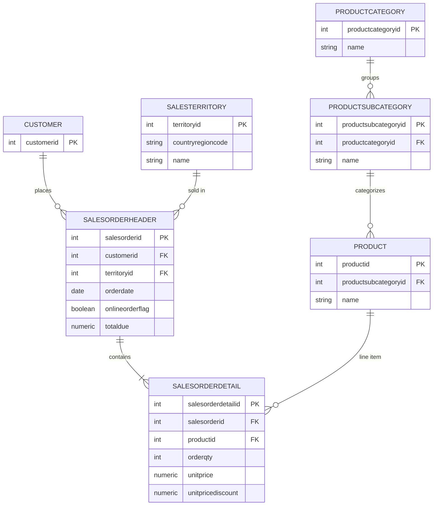

# Sales & Customer Analytics

## Client Background

Velocity Cycle Co. is a mid-sized manufacturer and distributor of bicycles, bike components, and cycling accessories, operating across North America, Europe, and the Asia-Pacific region. The company serves two distinct channels: a long-standing wholesale/B2B network supplying independent bike shops and regional distributors, and a newer direct-to-consumer online storefront.

Velocity Cycle Co.'s book of business spans 18,097 orders across the 2012-2013 period, generating over $86 million in revenue. The available data spans several dimensions, including sales, products, human resources, purchasing, and customer records — though this analysis is scoped specifically to sales performance across the two-year window.

Reporting to the Head of Sales, an in-depth analysis was conducted to evaluate Velocity Cycle Co.'s performance during this period. This review provides insights that internal teams such as sales, marketing, and operations can use to prioritize channel investment, protect high-value customer segments, and address regional gaps.

📊 **The Tableau Public dashboard for this project can be viewed here: [Velocity Cycle Co. Sales Analytics Dashboard](https://public.tableau.com/app/profile/kaori.refonsa/viz/VelocityCycleCo_SalesAnalyticsDashboard/Dashboard)**

The key insights and recommendations focus on the following areas:

**Northstar Metrics**
- Sales trends: revenue, order volume, and average order value across months and quarters
- Channel performance: online vs. offline transaction count and AOV, and the structural shift between them
- Product performance: category-level revenue concentration
- Customer segmentation: RFM-based value tiers and shopping patterns by segmentation
- Regional results: revenue by territory

---

## Entity Relationship Diagram

The tables below (a subset of the full AdventureWorks-style schema) were used across this analysis:

---

## Executive Summary

- Velocity Cycle Co. generated over $86M in revenue across 18,097 orders between 2012 and 2013, and the data points to three consistent patterns: the business is fundamentally a bikes company (84.58% of revenue), with components as a secondary driver and clothing/accessories together contributing under 3.2%.
- Customer value is extremely concentrated, as Champions make up just 4.82% of customers but generate the large majority of revenue, while At Risk customers account for 72.08% of the base but contribute only $10.9M — and this value split tracks closely with channel, since Champion is the only segment where offline purchasing dominates while every other segment skews overwhelmingly online, consistent with a broader gap where offline orders average $24,448 versus $1,234 online even as online order volume has surged since mid-2013 with a continually declining AOV.
- Revenue is geographically concentrated in North America led by the US, with Australia standing out as an anomaly whose high order volume but unusually low AOV mirrors the same high-volume/low-value pattern seen in the online channel. Together, these findings suggest that recent growth in volume — online orders, the Australian market, and At Risk customer acquisition — has not been matched by growth in value, while the business's most valuable customers and orders remain concentrated in its smaller, offline, North American base.

---

## Insights Deep Dive

### Q: How do monthly and quarterly sales trend during this period?
- While June and July show increases in both years, growth is concentrated in the second half of 2013; from May to October 2013, nearly every month sits well above the average. This could signal a rising revenue baseline heading into 2014 rather than just a stronger seasonal peak.
- Month-to-month volatility is consistent across both years (e.g., a high January followed by a steep February drop). The finance and operations team could budget accordingly based on these swings.

### Q: Which quarters are structurally strong or weak?
- Q3 consistently outperforms every other quarter in both years (+7.91% above average in 2012, +17.14% in 2013), and even as revenue grows year-over-year, the Q3-peak/Q4-drop shape holds in both years.
- The operations team could benefit from this data by increasing inventory in Q3 as understocking during a known peak could result in a lost-revenue risk.

### Q: How do transaction counts and AOV differ between online and offline channels by quarter?
- **Transaction count:** Offline sales are stable throughout both years, averaging 346.25 orders per quarter. Online transactions grew steadily through 2012 and into early 2013, then spiked sharply between Q2 and Q3 2013 (1,192 → 4,866) and kept climbing into Q4 2013 (5,674) — the surge isn't a one-quarter spike that plateaus, it's a step-change that continues rising through the rest of the year.
- **AOV:** There is a huge gap between the average AOVs based on online/offline channels. Offline purchases are big in volume, averaging $24,448, whereas online has only $1,234 AOV.
- For offline, while transaction counts nudge upward slightly across both years, AOV drifts down from its Q2 2012 peak (~$27,500) toward Q4 2013 (~$19,800), even as the channel remains the highest-value one by far.
- For online, while transaction count spiked dramatically toward Q2 2013, AOV kept declining — this could signal a growing online customer base whose purchases are low-spend. Meanwhile, the increase in transaction count of the online channel may be the driver behind the concentrated growth in the latter half of 2013.

### Q: Which product category dominates revenue?
- Bikes account for 84.58% of the $86M total revenue (2012-2013) — this is essentially a bike company, not a general sporting goods retailer.
- Components are the second driver at 12.31%, likely bought alongside or as replacements for bike parts.
- Clothing and Accessories combined are under 3.2% — worth evaluating whether to expand or deprioritize in favor of the core bike business.

### Q: Which customers are most valuable, based on recency, frequency, and monetary value?

**RFM Segmentation Methodology**

| Segment | Criteria |
|---|---|
| Champion | frequency > 2, monetary > $2,699.90, recency < 365 days |
| Lapsed Champion | frequency > 2, monetary > $2,699.90, recency ≥ 365 days |
| Loyal | frequency > 2, monetary ≤ $2,699.90 |
| Big Spender | frequency ≤ 2, monetary > $2,699.90 |
| At Risk | all other cases (frequency ≤ 2, monetary ≤ $2,699.90) |

*Monetary threshold ($2,699.90) is based on the average of `totaldue` across all orders in the dataset.*

**Findings**
- Champions are 4.82% of customers (600 people) but generate $79.1M — by far the largest revenue segment, more than 3x Big Spender's $26.3M despite being a fraction of the customer base. This is the clearest signal in the chart: a small group of customers carries most of the business.
- At Risk is the inverse pattern: 72.08% of customers (8,978 people), but only $10.9M in revenue, less than half of what Big Spender generates from a segment nearly 3x smaller (2,724 customers, 21.87%). The majority of the customer base contributes a minority of revenue.
- Big Spender sits in between: 21.87% of customers (2,724 people) generate $26.3M, the second-largest revenue pool. On a per-customer basis, Big Spender generates roughly $9,654 per customer; it's a meaningfully large group that still spends well above the base rate, just not at Champion's extreme concentration.
- Lapsed Champion is the smallest segment by customer count (just 5 people) but generates $481K — about $96,205 per customer. That's the second-highest per-customer value across all five segments, behind only Champion itself. This makes sense given how the segment is defined; they were high-value customers once, and the revenue reflects that history even though they haven't ordered recently.
- Loyal is the weakest segment on every axis — 1.20% of customers (149 people), just $117.9K in revenue, and the lowest per-customer value of all five segments (about $791).
- A pure-acquisition growth strategy without retention will keep refilling the same low-value pool (At Risk, 8,978 customers) without moving revenue upwards. Retention and upgrade paths targeting Big Spender (2,724 customers) → Champion are likely to move revenue more than acquisition alone.

### Q: Do high-value customer segments purchase through different channels than lower-value segments?
- Champion skews heavily offline. 82.81% of the segment's orders are offline versus 17.19% online, suggesting the business's most valuable customers primarily purchase through offline channels.
- At Risk is overwhelmingly online; 98.80% of the segment's orders are online versus 1.20% offline — consistent with the earlier finding that online AOV collapsed as transaction volume spiked in mid-2013. This suggests the online channel's order volume is dominated by this lower-value segment.
- Big Spender is also predominantly online (92.32% of orders) versus offline (7.68%) — worth further investigation to distinguish whether these are frequent smaller online purchases or occasional large ones, since Big Spender by definition has low order frequency (≤2 orders) but high monetary value.
- Loyal follows a similar pattern to Big Spender and At Risk — 91.65% of orders online versus 8.35% offline.
- Lapsed Champion is exclusively offline (100%, 29 orders) — consistent with offline customers having longer purchase histories, making them the only segment old enough to show up as "lapsed" within this 2-year window.
- Taken together, for every segment except Champion, the large majority of orders happen online. Champion stands out as the one segment where offline dominates order volume.

### Q: What product categories drive revenue within each customer segment, and does spending pattern differ by segment value?
- Bikes is the dominant revenue driver for four of the five segments — Lapsed Champion, Champion, Big Spender, and At Risk all derive their largest revenue share from bikes (roughly 40-57% depending on segment). Loyal is the exception, where Accessories dominates instead (~50%), with Bikes making up a comparatively small share.
- Components make up a meaningfully larger share of revenue for the three highest-value segments (Champion, Big Spender, Lapsed Champion) compared to At Risk, where Components are nearly negligible (~1%). This suggests higher-value customers are more likely to purchase complementary/upgrade parts alongside their main purchases, while At Risk customers' spending concentrates almost entirely in Accessories and Bikes — lower-commitment purchase categories.

### Q: Which countries generate the most revenue, and does order volume track revenue proportionally across markets?
- US dominates decisively — over $50M in revenue and nearly 6,900 orders, more than 3.5x the next-highest country (CA) in revenue and nearly 3x in order count. This one country alone appears to account for the large majority of total company revenue.
- CA is the clear second-largest revenue market (~$13.5M) but with only ~2,300 orders — implying a notably higher AOV than most other countries (~$5,900/order), consistent with the earlier finding that offline/wholesale channels (concentrated in North America) carry much higher AOV than online.
- AU is the standout anomaly: it has the second-highest order count (~3,900, more than CA) but generates less revenue than CA (~$7M vs ~$13.5M). That implies AU's average order value (roughly $1,800) is dramatically lower than every other country shown — even lower than DE, which has the smallest revenue and order count overall. This pattern — high volume, low value per order — mirrors the online-channel AOV collapse identified earlier, and is worth checking whether AU's order mix skews more online/low-value than other regions.
- FR, GB, and DE cluster together at the low end on both revenue (~$3-6M) and orders (~1,300-1,800) — none stands out individually, but together they represent a meaningfully smaller footprint than the North America + AU markets.
- Given the US's outsized share of both revenue and orders, near-term investment (marketing spend, inventory, channel expansion) should continue to prioritize protecting and growing that market rather than diversifying resources thin across the smaller European markets.

---

## Recommendations

**For the sales team, prioritize retention and upgrade paths for Big Spender → Champion over pure acquisition.**
Since a majority of customers (At Risk) contribute a small minority of revenue, continued acquisition-only strategies will keep refilling a low-value pool. Sales should focus outreach and account management on converting Big Spenders, who already generate ~$9,654 per customer, toward Champion-tier behavior.

**For the operations team, increase inventory ahead of Q3 in upcoming period.**
Q3 consistently outperforms other quarters (+7.91% in 2012, +17.14% in 2013). Understocking during this known peak risks lost revenue; inventory planning should be adjusted accordingly.

**Investigate the drivers behind declining online AOV despite rising online order volume.**
Online transaction volume surged from Q2 to Q3 2013 (1,192 → 4,866) while AOV continued to fall. Understanding whether this reflects a structurally lower-value new customer base or a shift in purchase behavior will determine whether marketing should focus on volume growth or value-per-order improvement in this channel.

**For the sales team, protect and reinforce the offline channel serving Champion customers.**
Champion is the only segment where offline purchasing dominates (82.81%), and this segment alone drives the majority of company revenue. Sales should ensure account relationships and service levels in this channel remain a protected priority rather than being deprioritized in favor of online expansion.

**For the product team, evaluate the strategic role of Clothing and Accessories.**
These categories combined contribute under 3.2% of revenue. Product/merchandising teams should assess whether continued investment in these lines is justified or whether resources are better redirected toward the core bikes and components business.

**Continue prioritizing US market investment while auditing Australia's order mix.**
The US drives the outsized share of both revenue and orders and should remain the primary investment focus. Separately, Australia's unusually low AOV relative to its order volume — the lowest of all markets shown — warrants investigation into whether it stems from a low-value/online-heavy order mix (addressable via channel strategy) or structurally different pricing/product mix (a separate assortment question) before further regional investment is committed.

---

## Scope & Limitations

- This analysis is based on **revenue only**; profitability and margin data were outside the scope of this review.
- Data is limited to the **2012-2013** period available in the dataset.

---

## Tools Used
- **SQL (PostgreSQL)** — data extraction, RFM segmentation, aggregation
- **Python (Pandas, Matplotlib)** — supplementary charting
- **Tableau Public** — interactive dashboard
